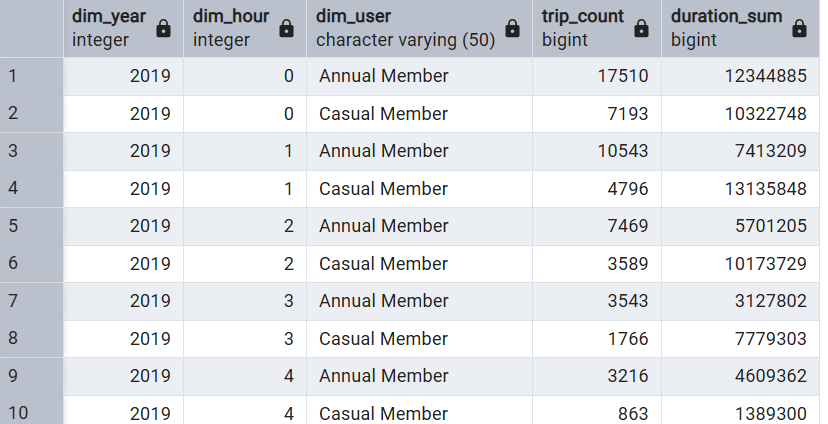
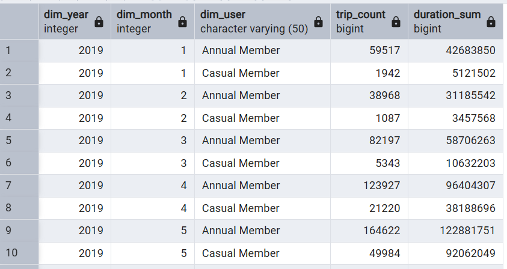

# Data Warehouse Project - Toronto Shared Bike (PostgreSQL Solution)

A data warehouse project of Toronto Shared Bike using PostgreSQL database.

- [Data Warehouse Project - Toronto Shared Bike (PostgreSQL Solution)](#data-warehouse-project---toronto-shared-bike-postgresql-solution)
  - [Data Warehouse](#data-warehouse)
    - [Logical Design](#logical-design)
    - [Physical Implementation](#physical-implementation)
    - [Connect with pgAdmin](#connect-with-pgadmin)
  - [ETL Pipeline](#etl-pipeline)
    - [Confirm](#confirm)
    - [Export Processed Data](#export-processed-data)
  - [Execute Pipeline](#execute-pipeline)

---

## Data Warehouse

- Data Source:
  - https://open.toronto.ca/dataset/bike-share-toronto-ridership-data/

### Logical Design


---

### Physical Implementation

- Initialize PostgreSQL Instance

```sh
cd pgsql
docker compose up -d
```

---

### Connect with pgAdmin

- Connection


- Tables & views


---

## ETL Pipeline

- Diagram


- Extract

```sh
docker exec -it postgresql bash /scripts/etl/extract.sh
```


- Transform

```sh
docker exec -it postgresql bash /scripts/etl/transform.sh
```


- Load

```sh
docker exec -it postgresql bash /scripts/etl/load.sh
```


- Refresh Materalized View

```sh
docker exec -it postgresql bash /scripts/mv/mv_refresh.sh
```


---

### Confirm

- Time dimension - hour

```sh
SELECT
	dim_year
	, dim_hour
	, dim_user
	, trip_count
	, duration_sum
FROM toronto_shared_bike.dw_schema.mv_user_year_hour_trip
ORDER BY
    dim_year
    , dim_hour
    , dim_user
;
```



- Time dimension - month


```sh
SELECT
	dim_year
	, dim_month
	, dim_user
	, trip_count
	, duration_sum
FROM toronto_shared_bike.dw_schema.mv_user_year_month_trip
ORDER BY
    dim_year
    , dim_month
    , dim_user
;
```



- Station dimension

```sh
SELECT
	dim_year
	, dim_user
	, dim_station
	, trip_count
FROM toronto_shared_bike.dw_schema.mv_user_year_station
ORDER BY
    dim_year
    , dim_user
    , trip_count DESC
;
```


---

### Export Processed Data

```sh
docker exec -it postgresql bash /scripts/export/export.sh
```


---

## Execute Pipeline


```sh
docker exec -it postgresql bash /scripts/pipeline/pipeline.sh
```